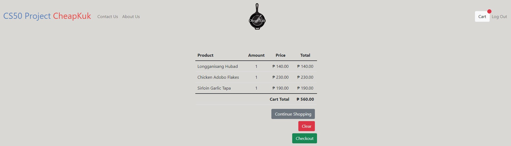

Currently trying to optimize code...
# CheapKuk Website
#### A flask-based website for my friends' small business that sells ready-to-cook meat products.

This project is a simple website that lets customers of CheapKuk order their ready-to-cook Filipino meat products in a very simple way. The shop has 4 products as of today: *Sirloin Garlic Tapa*, *Longganisang Hubad*, *Smoked Rub Liempo*, and *Chicken Adobo Flakes*. The structure of the whole website is inspired by the Finance problem set.

## User Walkthrough:
#### For customers:

1. The first thing that the customer will see is the login page of the website. 
If the customer has already registered, logging in using the registered username and password will let you proceed to the main page of the website. If not, the user must register by clicking the 'Register' link at the top right corner of the page.


2. After successfully registering, the user can now proceed to login and the user will be redirected to the main page of the website where the products are shown.


3. Scrolling down the main page, the customer will see all of the products with a button on each of them indicated with a plus sign. If the customer wants to order the specific product, clicking the button would add it to the 'cart'. Customers can add more by simply clicking the button again. For every click, the item updates its quantity to +1 and will be redirected to the 'Cart' page.


4. On the 'Cart' page, the customer can choose whether to order more products by clicking the 'Continue Shopping' button, clear its 'cart' by clicking the 'Clear' button, or to checkout and proceed placing the order by clicking the 'Checkout' button.

5. Upon clicking the Checkout, a side panel will appear and the customer will see the total amount to be paid as well as its payment option. For now, the business only caters cash-on-delivery payments or payment upon arrival.

6. Once clicked, an alert will popup saying that your order is confirmed and the information will be sent to the owners.


#### For the owners:
1. Pre-made accounts are made for the business owners and are used as login credentials for the website.

2. Once logged in, the admin account will immediately see the summary of pending orders for the day. Information about the customer's name, address, contact number, and all the orders are shown as seen in the image below.


## Source Files
#### Folders:
```
/images/
```
The `/images/` folder contains all of the images that are shown here in README.md.
```
/static/
```
The `/static/` folder contains all of the images used in the website.
```
/templates/
```
`/templates/` folder contains all of the `.html` files that are used for this website.

#### Individual files:
```
/templates/layout.html
```
This file contains the template for most of the `.html` files in this website. For its `<head>`, it contains the links for Bootstrap, the money bag icon, and the `styles.css` file. The body would contain the navigation bar and every link that is placed in it: **Login**, **Register**, **Logout**, **About Us**, and **Contact Us**.
One feature that was inspired by CS50X's Finance problem was the ``. This makes the other links visible only when a user has logged in (**About Us**, **Contact Us**, **Logout**). If no user is logged in, only **Register** and **Log In** are visible.
Line 54 of this file will be the start of the template blocks that will be used for the other files. The `<script>` at the bottom would be for the popover that will be used later in `cart.html`.
```
/templates/register.html
```
This file contains the registration page of the website. You will be seeing here all the fields that will be needed by the website and business owner for them to easily track the order and all the information with it. This is one of the files that uses the `layout.html` as its template. The bottom part would be the `<script>` tag that would connect the `scripts.js` file.
```
/templates/password_mismatch.html
```
A clone of the `register.html` file, but this only renders if the password that was inputted on the password fields while registering do not match.
```
/templates/login.html
```
This file is quite similar to the `register.html` in terms of the input fields. This page will take username and password as input and assuming the credentials are registered prior to logging in, it will redirect to either the main ordering page if you are a customer, or the `orders.html` page if you logged in as an administrator account.
```
/templates/index.html
```
This file would be the main ordering page of the website. This would contain the navigation bar template from `layout.html`, a welcome message, and all the products available for sale at the bottom of the page once you try to scroll down. There will be four (4) products available: *Sirloin Garlic Tapa*, *Longganisang Hubad*, *Smoked Rub Liempo*, and *Chicken Adobo Flakes*. There will be a botton for each product which can be clicked so that the customer can add that specific product to their cart for purchasing. An additional script was added at the bottom for the *plus* icons which is from [Feathers](https://feathericons.com/).
```
/templates/apology.html
```
This file was used in CS50X's Finance problem set and I reused it here for invalid login cases.
```
/templates/about.html
```
This page would contain some information about CheapKuk.
```
/templates/cart.html
```
This would be the page that will summarize the *cart* of the current customer that is logged in. It also contains the buttons for **Continue Shopping**, if the customer wants to order more products or add quantities to their orders, **Clear** if they want to delete all the entries in their cart, and **Checkout** to proceed with placing the order. The **Checkout** button will popover a side panel which will indicate the information of the customer (**Name**, **Address**, **Mobile Number**) so that they would be able to check if the information they provided was indeed correct. A **Place Order** button will also be there to finally place the order once clicked.
```
/templates/success.html
```
This is the page that renders when the customer successfully places and confirms an order. It will show a thank you message and a message that informs the customer that the team may reach out for further clarifications of the order.
```
/templates/orders.html
```
Pre-made administrator accounts will be provided to the owners for them to use in this website. If the owner is logged in, this page will be the first thing that they will see. It summarizes all the orders that are placed by the customers for the current day. It will contain the name of the customer, their address, mobile number, and all of their confirmed orders. This would help the owners keep track of all their customers' orders easily reach out to them if they need any clarifications.
```
cheapkuk.db
```
This is the main database that holds all of the information about the customers, the products available, and all of the orders and transactions made.
```
app.py
```
This is the file that would move all of the things underneath the website. It is also derived from the Finance problem set and I made the tweaks for it to work for the CheapKuk website. It holds functions from the login session, to SQL queries, rendering of `.html` files, etc.
```
helpers.py
```
This file contains functions for flask sessions and the `apology.html` page for invalid logins.
